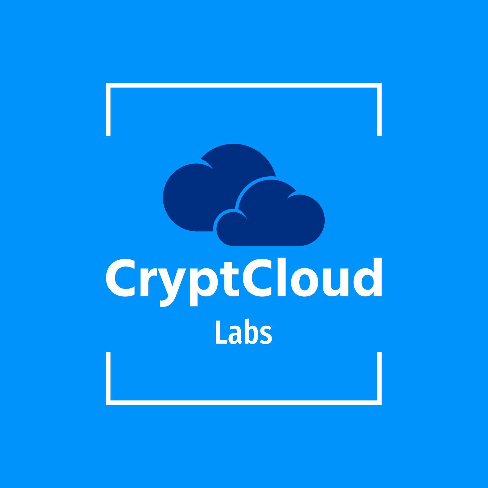

# CryptCloud Platform Documentation & Wiki
## Built with [Foam](https://github.com/foambubble)

---

## Docs

## Project

## Community

---
**👋 Welcome to the CryptHub Knowledge Base!**

## Getting started
### Dive in to our [Foam](https://github.com/foambubble) based Knowledge base!

- [Wiki Index](https://github.com/IncognitLabs/CryptHub-Docs/blob/f06486b12170e405b682c56fc9213b6ef42476fd/docs/index.md)
- [inbox](./inbox.md) - a place to write down quick notes to be categorized later
- [getting-started](./getting-started.md) - learn how to use your Foam workspace
- [todo](./todo.md) - a place to keep track of things to do

